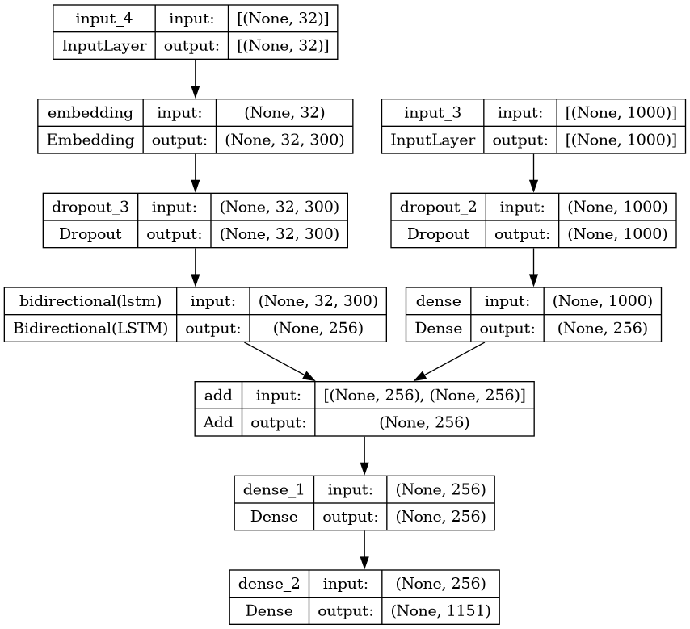

## Overview

This project focuses on generating captions for images in Vietnamese using a deep learning model. The primary components of the project include feature extraction from images using MobileNetV3Large and creating word embeddings using fasttext-vietnamese-word-vectors. The dataset used for training is the UIT-ViIC dataset.

## Dataset

- **Dataset Name**: UIT-ViIC
- **Description**: The UIT-ViIC dataset consists of images with Vietnamese captions, which is used for training the image captioning model.

## Feature Extraction

- **Model**: MobileNetV3Large
- **Purpose**: Used to extract features from images.

## Embedding Matrix

- **Embedding Source**: fasttext-vietnamese-word-vectors
- **Purpose**: Provides pre-trained word vectors to create the embedding matrix for the model.

## Main Model

The model architecture used in this project is defined as follows:

### Model Summary

1. **Image Features Input**:
    - **Shape**: (1000,)
    - **Layers**:
        - Dropout (0.5)
        - Dense (256 units, ReLU activation)

2. **Caption Input**:
    - **Shape**: (max_length,)
    - **Layers**:
        - Embedding (vocab_size, embedding_dim, initialized with fasttext-vietnamese-word-vectors, non-trainable)
        - Dropout (0.5)
        - Bidirectional LSTM (128 units)

3. **Decoder**:
    - **Layers**:
        - Add (Image features and caption features)
        - Dense (256 units, ReLU activation)
        - Dense (vocab_size, Softmax activation)

### Compilation
- **Loss Function**: Categorical Crossentropy
- **Optimizer**: Adam (learning rate = 0.0001)

## Acknowledgements
Please note that this version of the dataset contains only sport-related images, so the model is specifically trained and optimized for generating captions for sports images. The model was trained on Kaggle, utilizing the dataset and word vectors available on the Kaggle platform

- **UIT-ViIC Dataset**: [Link to Dataset](https://www.kaggle.com/datasets/vitngquang/uit-viic-v1-0-vietnamese-image-captioning)]
- **fasttext-vietnamese-word-vectors**: [Link to word vectors](https://www.kaggle.com/datasets/aeryss/fasttext-vietnamese-word-vectors-full)
